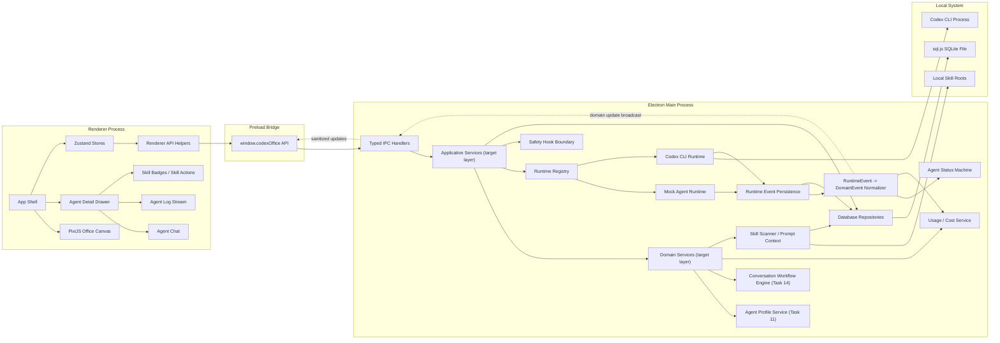

# Current Architecture Diagram

This diagram represents the current implementation after Tasks 01-10.



The boxes labeled `target layer` are the architecture direction for upcoming tasks. Some current code still routes more directly through IPC handlers. Future V1 work should move cross-module workflow logic into application services and domain services.

## Module Notes

### Renderer Process

The renderer process is the frontend UI. It runs React and PixiJS.

It owns:

- app shell layout,
- pixel office rendering,
- agent selection,
- agent detail drawer,
- chat UI,
- log display,
- skill badges and skill actions,
- frontend-only UI state.

The renderer must not directly access local files, databases, child processes, or Codex CLI. It talks to the main process through the preload API.

### App Shell

`App Shell` is the top-level React screen.

It wires together:

- sidebar navigation,
- action buttons,
- office canvas,
- selected agent detail drawer,
- frontend stores.

Current file:

- `src/renderer/App.tsx`

### PixiJS Office Canvas

`PixiJS Office Canvas` is the visual office.

It renders agents as small pixel-style workers and supports:

- showing all known agents,
- clicking an agent,
- dragging an agent,
- persisting agent position through IPC,
- showing status through color.

Current files:

- `src/renderer/office/OfficeCanvas.tsx`
- `src/renderer/office/officeScene.ts`
- `src/renderer/office/agentSprites.ts`
- `src/renderer/office/officeLayout.ts`

### Agent Detail Drawer

`Agent Detail Drawer` is the right-side panel for the selected agent.

It shows:

- role,
- status,
- runtime kind,
- workspace,
- assigned skills,
- chat,
- logs.

Current file:

- `src/renderer/components/AgentDetailDrawer.tsx`

### Agent Chat

`Agent Chat` lets the human manager send a message to one selected agent.

It uses `window.codexOffice.runtime.sendMessage(...)` through the frontend store/API path. Runtime events update persisted messages and the UI refreshes the conversation.

Current file:

- `src/renderer/components/AgentChat.tsx`

### Agent Log Stream

`Agent Log Stream` displays recent runtime-related events for the selected agent.

It is currently backed by persisted timeline events such as:

- `log_line`,
- `command_started`,
- `command_completed`,
- `error_occurred`,
- `file_touched`.

Current file:

- `src/renderer/components/AgentLogStream.tsx`

### Skill Badges / Skill Actions

`Skill Badges / Skill Actions` show assigned skills and allow the user to scan, assign, or remove skills.

Current file:

- `src/renderer/components/AgentSkillBadges.tsx`

### Zustand Stores

`Zustand Stores` are frontend state containers.

They hold UI-ready data such as:

- agents,
- messages,
- skills,
- tasks,
- meetings,
- timeline events.

They are like a small frontend memory layer. Components read from these stores instead of each component fetching everything independently.

Stores should be the usual place where renderer code calls `window.codexOffice`. This keeps React components focused on presentation and avoids spreading preload API calls across the UI.

Current files:

- `src/renderer/stores/agentStore.ts`
- `src/renderer/stores/chatStore.ts`
- `src/renderer/stores/skillStore.ts`
- `src/renderer/stores/taskStore.ts`
- `src/renderer/stores/eventStore.ts`
- `src/renderer/stores/meetingStore.ts`

### Preload Bridge

The preload bridge is the safe boundary between the renderer and Electron main process.

It exposes a limited API on `window`:

```ts
window.codexOffice
```

The renderer can call this API, but it cannot directly access raw Electron IPC, Node.js filesystem APIs, SQLite, or child processes.

Current files:

- `src/preload/index.ts`
- `src/preload/global.d.ts`

### window.codexOffice API

`window.codexOffice API` is the frontend's local backend SDK.

Examples:

```ts
window.codexOffice.runtime.spawnAgent(...)
window.codexOffice.runtime.sendMessage(...)
window.codexOffice.skills.scan()
window.codexOffice.agents.list()
window.codexOffice.messages.listBySession(sessionId)
```

It is currently named after the early product name. The name can be revisited later when the product naming settles.

The name is less important than the boundary: this API is the only exposed renderer-to-main bridge. It should expose product actions and typed subscriptions, not raw IPC or Node APIs.

Type definition:

- `src/shared/ipc.ts`

### Electron Main Process

The main process owns privileged local work.

It is responsible for:

- IPC validation,
- database access,
- runtime process management,
- skill scanning,
- runtime event persistence,
- local Codex process discovery.

Renderer code should never bypass the main process for privileged work.

Current file:

- `src/main/index.ts`

### Typed IPC Handlers

`IPC` means inter-process communication.

Typed IPC handlers receive requests from the preload API, validate payloads, and call the correct main-process service.

Examples:

- create agent,
- spawn runtime session,
- send runtime message,
- scan skills,
- update agent position,
- query events.

Current files:

- `src/main/ipc/createIpcHandlers.ts`
- `src/main/ipc/registerIpcHandlers.ts`
- `src/main/ipc/validators.ts`
- `src/shared/ipc.ts`

Target direction:

- IPC validates input.
- IPC delegates to application services.
- IPC returns serializable responses.
- IPC broadcasts sanitized updates.

It should not own large business workflows such as profile snapshot rules, task state transitions, meeting review loops, or cost aggregation.

### Application Services

`Application Services` are the target coordination layer for complete user actions.

Examples:

- create agent from profile,
- spawn or stop runtime sessions,
- send agent messages,
- assign tasks,
- start meeting workflows,
- record token usage and update cost summaries.

Current implementation is still early and some coordination lives near IPC/runtime modules. Tasks 11-14 should progressively introduce this layer.

### Domain Services

`Domain Services` own reusable product rules.

Examples:

- profile snapshot generation,
- capability matrix calculation,
- task status transition rules,
- meeting flow rule evaluation,
- runtime event normalization,
- token cost estimation,
- permission policy decisions.

Domain services should be testable without renderer code.

### RuntimeEvent -> DomainEvent Normalizer

Runtime adapters emit provider-specific runtime signals. The product needs stable domain events for the timeline, task board, meeting room, usage dashboard, and audit UI.

The normalizer should convert runtime output into product-level records such as:

- agent status changed,
- message created,
- command completed,
- token usage recorded,
- meeting review requested,
- permission denied.

MVP can store both raw and normalized event details in the existing event table, but renderer UI should depend on product-level event semantics.

### Runtime Registry

`Runtime Registry` decides which runtime adapter owns a session.

Current runtime adapters:

- `MockAgentRuntime`
- `CodexCliRuntime`

The registry lets the app support multiple runtime providers without changing UI code.

Current file:

- `src/main/runtime/RuntimeRegistry.ts`

### Mock Agent Runtime

`Mock Agent Runtime` is the deterministic test runtime.

It can:

- spawn a fake session,
- stream response chunks,
- emit token usage,
- emit status changes,
- stop a session.

It proves the event pipeline before real Codex integration.

Current file:

- `src/main/runtime/MockAgentRuntime.ts`

### Codex CLI Runtime

`Codex CLI Runtime` starts and monitors app-controlled Codex CLI processes.

It handles:

- spawn arguments,
- working directory,
- initial prompt,
- permission mode,
- skill prompt context,
- stdout/stderr streaming,
- process stop,
- process exit handling,
- token usage parsing or estimation.

Runtime adapters should not own task board state, meeting orchestration, or manager dashboard aggregation. They emit provider signals; application/domain services decide product meaning.

Current file:

- `src/main/runtime/CodexCliRuntime.ts`

### Agent Status Machine

`Agent Status Machine` maps runtime signals into product statuses.

Product statuses include:

- `idle`,
- `thinking`,
- `running_command`,
- `reading_files`,
- `editing_files`,
- `waiting_user_input`,
- `error`,
- `completed`,
- `stopped`.

Current file:

- `src/main/runtime/agentStatusMachine.ts`

### Skill Scanner / Prompt Context

`Skill Scanner / Prompt Context` discovers local skills and prepares skill instructions for agents.

It handles:

- scanning local skill roots,
- finding `SKILL.md`,
- parsing skill name, description, and category,
- persisting discovered skills,
- building assigned skill prompt context.

Current files:

- `src/main/skills/scanSkills.ts`
- `src/main/skills/parseSkillMarkdown.ts`
- `src/main/skills/buildSkillPromptContext.ts`

### Agent Profile Service

`Agent Profile Service` is planned in Task 11.

It should own:

- profile CRUD,
- profile default skills,
- profile import/export,
- immutable profile snapshot generation,
- capability matrix metadata.

Profiles are the canonical source for reusable agent configuration. Create-agent, runtime prompt building, default skill assignment, permission preset selection, collaboration behavior, and visual identity should all consume the generated profile snapshot.

### Conversation Workflow Engine

`Conversation Workflow Engine` is planned in Task 14.

It should sit below the meeting room UI and support:

- user-to-many-agent messages,
- user-to-specific-agent messages,
- agent-to-agent review requests,
- reviewer feedback routed back to a developer agent,
- stop conditions,
- max rounds,
- manager escalation,
- transition audit records.

This keeps the meeting room extensible enough for future automatic development -> review -> revision loops.

### Usage / Cost Service

`Usage / Cost Service` turns runtime usage into manager-visible cost information.

It should keep separate:

- raw token usage records,
- summaries by agent, session, task, model, workspace, and time range,
- price configuration for estimated cost.

Usage source must be visible as `reported`, `estimated`, or `manual`.

### Runtime Event Persistence

`Runtime Event Persistence` converts runtime events into durable app state.

It persists:

- messages,
- log events,
- status transitions,
- token usage,
- session completion,
- session stop/error events.

Current file:

- `src/main/runtime/persistRuntimeEvent.ts`

### Database Repositories

`Database Repositories` are the only code layer that should read/write the local database directly.

They provide typed functions for:

- agents,
- sessions,
- messages,
- skills,
- tasks,
- meetings,
- events,
- token usage,
- settings.

Current folder:

- `src/main/db/repositories/`

### Local System

`Local System` represents resources outside the app code.

The main process can interact with:

- local Codex CLI processes,
- local skill folders,
- the local SQLite-compatible database file.

The renderer cannot access these directly.

### sql.js SQLite File

The current MVP database engine is `sql.js`.

The architecture treats it like SQLite and keeps access behind repositories so the database engine can be swapped later without changing renderer code.

Current files:

- `src/main/db/client.ts`
- `src/main/db/schema.ts`
- `src/main/db/migrations/`

## Data Flow Examples

### Create Or Discover Agents

```text
Renderer App
  -> Zustand agentStore
  -> window.codexOffice.runtime.discoverAgents()
  -> IPC handler
  -> Database repositories + local Codex process discovery
  -> Renderer store updates
```

### Send Message To Agent

```text
AgentChat
  -> window.codexOffice.runtime.sendMessage(sessionId, message)
  -> IPC handler creates user and agent message records
  -> Runtime Registry routes message to active runtime
  -> MockAgentRuntime or CodexCliRuntime emits runtime events
  -> Runtime Event Persistence writes chunks/status/token usage
  -> runtime:event broadcast updates renderer
```

### Scan And Assign Skills

```text
AgentSkillBadges
  -> window.codexOffice.skills.scan()
  -> IPC handler
  -> Skill Scanner reads local SKILL.md files
  -> Database repositories store skills
  -> UI shows available skills
  -> user assigns skill
  -> assigned skill prompt context is injected into future runtime calls
```

### Runtime Event Persistence

```text
Runtime Event
  -> persistRuntimeEvent
  -> RuntimeEvent -> DomainEvent normalizer
  -> Agent Status Machine
  -> messages / events / sessions / token_usage tables
  -> runtime:event broadcast
  -> Renderer refreshes stores
```

## Current Task Coverage

- Tasks 01-05 built the foundation, database, IPC, renderer stores, and mock runtime.
- Tasks 06-10 added Codex CLI runtime, status mapping, skill system, PixiJS office, and agent detail/chat UI.
- Task 11 is next and should extend the architecture with Agent Profiles and the capability matrix.
