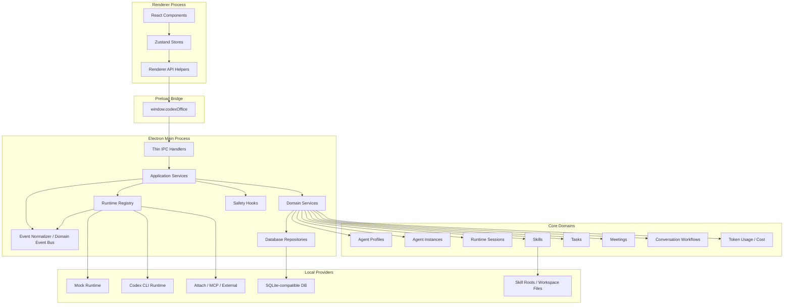

# Domain Model And Target Layering

This document defines the target product architecture that Tasks 11-18 should follow. It separates UI, IPC, application services, domain services, runtime adapters, and persistence so future features can grow without turning IPC handlers or React components into business-logic containers.

## Target Layer Diagram

## Layer Responsibilities

### Renderer Components

React and PixiJS components render product surfaces only. They should not contain orchestration rules, profile snapshot generation, runtime routing, or persistence decisions.

### Zustand Stores

Stores hold UI-ready state and call preload APIs. Stores are the preferred place for renderer code to access `window.codexOffice`; individual components should call store actions instead of talking to the preload bridge directly when practical.

### Preload API

`window.codexOffice` is the local frontend SDK. The name can change later, but the role is correct: it is a typed, explicit API boundary. It should expose product actions, not raw Electron, Node, or database capabilities.

### Thin IPC Handlers

IPC handlers validate payloads, call application services, and return serializable results. They should not own business workflows such as profile application, meeting handoff logic, task state transitions, cost aggregation, or runtime event interpretation.

### Application Services

Application services coordinate a complete user action across domain services, repositories, runtime adapters, event publishing, and safety hooks.

Examples:

- `AgentApplicationService.createAgentFromProfile(...)`
- `RuntimeApplicationService.sendMessage(...)`
- `TaskApplicationService.assignTask(...)`
- `MeetingApplicationService.startWorkflow(...)`
- `UsageApplicationService.recordRuntimeUsage(...)`

### Domain Services

Domain services own product rules inside one domain. They are testable without Electron IPC.

Examples:

- profile snapshot generation,
- capability matrix calculation,
- task status transition rules,
- meeting flow rule evaluation,
- runtime event normalization,
- token cost estimation,
- permission policy decisions.

### Runtime Adapters

Runtime adapters only know how to talk to a provider such as mock runtime, Codex CLI, attached Codex sessions, MCP, or future external providers. They should emit raw runtime signals and avoid product policy decisions.

### Repositories

Repositories own durable reads and writes. They should not call runtime adapters, preload APIs, renderer stores, or React components.

## Event Model

The product should distinguish provider events from product events.

### RuntimeEvent

A `RuntimeEvent` is a raw or lightly normalized signal from a runtime provider.

Examples:

- stdout line,
- stderr line,
- process started,
- process exited,
- message chunk,
- command started,
- token usage reported.

Runtime events are useful for logs, debugging, and provider-specific behavior.

### DomainEvent

A `DomainEvent` is a product-level event that the UI, timeline, task board, meeting room, and audit system can understand.

Examples:

- `agent_status_changed`,
- `message_created`,
- `task_moved_to_waiting_review`,
- `meeting_review_requested`,
- `meeting_manager_escalation_created`,
- `token_usage_recorded`,
- `permission_denied`.

The current `events` table can store both kinds during MVP if `type` and `payload_json` identify the source and category clearly. As the app grows, the main process should centralize conversion in an event normalizer so renderer code does not need to understand provider-specific runtime details.

## Agent Profile As Configuration Source

Agent Profile is the canonical reusable configuration source for agent creation. A profile can define:

- role and persona,
- long-term instructions,
- default skills,
- model/profile,
- permission preset,
- workspace scope,
- tool access,
- startup workflow,
- validation policy,
- collaboration behavior,
- communication style,
- risk tolerance,
- output preferences,
- visual identity.

When creating an agent, the app should generate `profile_snapshot_json` in the main process. Runtime prompt context, default skill assignment, permission defaults, collaboration behavior, and visual identity should come from that snapshot.

## Conversation Workflow Model

The meeting room is the first UI for multi-agent coordination, but the underlying model should be a reusable conversation workflow engine.

A workflow should support:

- user-to-many-agent messages,
- user-to-specific-agent messages,
- agent-to-agent review requests,
- reviewer feedback routed back to the original agent,
- stop conditions,
- maximum review rounds,
- manager escalation rules,
- saved transition reasons.

This means `MeetingRoom` is a product surface, while `ConversationOrchestrator` or `WorkflowOrchestrator` is the reusable main-process domain service. Later, tasks can use the same engine for automatic developer -> reviewer -> developer loops even when the meeting UI is not open.

## Usage And Cost Model

Token and cost tracking has three layers:

- raw usage records from runtime events,
- durable summaries by message, session, task, agent, model, workspace, and time range,
- price configuration used to estimate cost when the provider does not report exact cost.

The manager dashboard should make the source visible: `reported`, `estimated`, or `manual`. Cost numbers should be treated as estimates unless the runtime provider returns billing-grade usage data.

## Safety Hook Strategy

The full Safety Permission Layer remains a late task because the first user is the local project owner. However, the runtime path should still include a safety hook early.

Before Task 17, the hook can be conservative and default-allow for current MVP behavior. Task 17 should replace that default with risk detection, approval prompts, scoped allow rules, redaction, and audit events without changing the runtime adapter interface.

## Design Rules

- Components call stores; stores call preload APIs.
- IPC handlers stay thin and call application services.
- Application services coordinate workflows and event publishing.
- Domain services own reusable product rules.
- Runtime adapters emit provider signals.
- Event normalization converts provider signals into product events.
- Agent Profiles are the source of default agent configuration.
- Conversation workflows must be reusable outside the meeting room UI.
- Token usage must keep raw records separate from cost summaries and price configuration.
- Safety hooks must sit on the runtime path even before the full permission UI exists.
