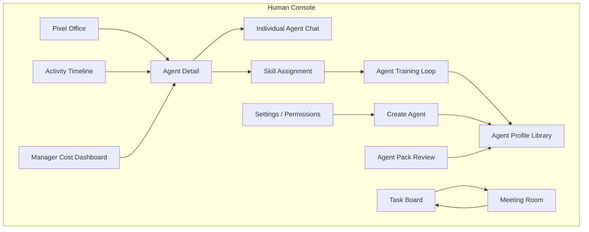

# Product View And Feature Ownership

This document defines what the product supports from the manager's point of view and maps each feature to an ownership type and system component.

The product positioning is: a local Agent Operating System for one-person companies. The human user acts as the company manager/operator, while specialized agents behave like a visible digital team. The product views below are not standalone chat tools; they are control surfaces inside the Agent OS.

The Pixel Office is the primary Human Console / Mission Control view. It exists to make agent state, work ownership, cost, meetings, and audit signals visible and actionable.

The core product promise is agent cultivation. Users should feel that they are training digital employees, not repeatedly prompting disposable assistants. Product views must therefore make reusable skills, profile changes, feedback loops, workflow memory, review outcomes, and cost patterns visible enough for the manager to improve the team over time.

## Human Console View Diagram

## Ownership Type Definitions

| Ownership Type | Meaning |
| --- | --- |
| User Control Surface | User-facing UI where the human manager observes, decides, or acts. |
| Agent Management | Agent identity, profile, capability, status, and configuration ownership. |
| Agent Execution | Runtime session control, process lifecycle, message streaming, and provider integration. |
| Workflow / Coordination | Multi-step work management, task flows, meetings, review loops, and escalation. |
| Context / Knowledge | Profile snapshots, skills, workspace context, memory, and prompt context. |
| Governance / Audit | Permission policy, audit trail, event logs, timeline, and cost accountability. |
| Ecosystem / Extensibility | Agent Packs, integrations, plugins, MCP, GitHub, community sharing. |
| Platform Infrastructure | Database, IPC, preload bridge, local persistence, system boundaries. |

## Supported Product Views

| Product View | User Goal | Supported Features | Ownership Type | Primary System Components | Stage |
| --- | --- | --- | --- | --- | --- |
| Pixel Office | See local agents as office workers. | Agent sprites, selection, status color, drag position persistence. | User Control Surface | Human Console, Agent Registry, Event Logs | MVP base complete |
| Agent Detail | Inspect one agent. | Role, status, runtime kind, workspace, skills, logs, chat. | User Control Surface | Human Console, Agent Registry, Audit Engine | MVP base complete |
| Individual Agent Chat | Talk to one agent. | User message, streamed agent response, persisted messages, log updates. | Agent Execution | Message Router, Runtime Adapter Layer, Event Logs | MVP base complete |
| Create Agent | Create an app-controlled agent. | Name, role, working directory, initial task, runtime spawn. | Agent Management | Human Console, Agent Registry, Orchestration Center, Runtime Adapter Layer | Partial MVP, full profile flow in Task 12 |
| Agent Profile Library | Manage reusable agent configurations. | CRUD, duplicate, import/export, default skills, permission presets, capability matrix. | Agent Management | Agent Registry, Context / Memory, Permission Policy Engine | Task 11 complete |
| Skill Assignment | Personalize an agent with skills. | Scan skills, parse `SKILL.md`, assign/remove skill, inject skill context. | Context / Knowledge | Context / Memory, Agent Registry, Runtime Adapter Layer | MVP base complete |
| Agent Training Loop | Turn task feedback into reusable employee behavior. | Review result, capture correction, propose skill/profile/workflow update, reuse on the next task. | Context / Knowledge | Context / Memory, Agent Registry, Task Engine / DAG, Audit Engine, Event Logs | V1/V2 |
| Task Board | Manage work assigned to agents. | Backlog, assigned, in progress, waiting review, done, failed, task assignment. | Workflow / Coordination | Task Engine / DAG, Orchestration Center, Audit Engine | Task 13 |
| Activity Timeline | Understand what happened. | Event filters by agent/task/type/time, runtime events, domain events, audit records. | Governance / Audit | Audit Engine, Event Logs, Agent Registry | MVP base plus Task 13 filters |
| Run History / Session Archive | Revisit previous agent runs. | Prompts, messages, logs, status transitions, files touched, errors, usage. | Governance / Audit | Event Logs, Audit Engine, Runtime Adapter Layer | Task 13 |
| Manager Cost Dashboard | Know how much each agent costs. | Token usage by agent/session/task/model/time, estimated cost, usage source. | Governance / Audit | Usage Service, Event Logs, Audit Engine | MVP base plus Task 13 dashboard |
| Meeting Room | Talk with multiple agents. | Group chat, addressed messages, moderator summary, saved notes. | Workflow / Coordination | Message Router, Orchestration Center, Agent Registry | Task 14 |
| Agent-To-Agent Review Flow | Let agents review and revise each other. | Developer -> reviewer -> developer loop, stop conditions, max rounds, manager escalation. | Workflow / Coordination | Task Engine / DAG, Message Router, Orchestration Center, Audit Engine | Task 14 foundation, expands later |
| Agent Pack Review | Install community reusable agent packages. | Inspect manifest, profiles, skills, assets, permissions, validation status. | Ecosystem / Extensibility | Agent Packs, Agent Registry, Permission Policy Engine, Audit Engine | Task 15 |
| Settings / Permissions | Control local execution policy. | Permission presets, allow rules, approval decisions, redaction settings. | Governance / Audit | Permission Policy Engine, Audit Engine, Human Console | Task 17 |
| Project Workspace Selector | Separate projects and workspaces. | Active workspace, project-scoped agents/tasks/events/settings. | Platform Infrastructure | Settings, Agent Registry, Event Logs | V2 |
| Integrations | Connect future providers and tools. | Attach mode, MCP, GitHub, plugins, external runtimes. | Ecosystem / Extensibility | Runtime Adapter Layer, Integrations, Message Router | V2 |

## Product Capability Groups

### Manager Control

The human manager can:

- see agents in the pixel office,
- inspect a selected agent,
- create app-controlled agents,
- chat with agents,
- assign skills,
- review activity and cost,
- approve or deny risky actions when the full permission layer exists.

### Agent Personalization

The product supports personalization through:

- Agent Profiles,
- role and persona,
- long-term instructions,
- skills,
- model/profile selection,
- permission presets,
- workspace scope,
- tool access,
- memory preferences,
- validation and collaboration behavior,
- visual identity.

### Agent Execution

The product supports agent execution through:

- mock runtime for deterministic development,
- Codex CLI spawned runtime for app-controlled sessions,
- future attach mode,
- future MCP bridge,
- runtime events,
- status mapping,
- message streaming.

### Work Coordination

The product supports coordination through:

- task board,
- task status transitions,
- meeting room,
- message routing,
- review loops,
- manager escalation,
- future DAG dependencies.

### Governance And Visibility

The product supports manager visibility through:

- activity timeline,
- run history,
- event logs,
- audit trail,
- token usage,
- cost dashboard,
- permission decisions,
- Agent Pack inspection.

## Feature Ownership Rules

- Human Console owns user interaction, not business policy.
- Agent Registry owns agent identity and capability state.
- Orchestration Center owns multi-step product flows.
- Task Engine / DAG owns task state and dependency behavior.
- Message Router owns message delivery and addressing.
- Context / Memory owns prompt context and reusable knowledge.
- Permission Policy Engine owns allow/deny policy.
- Audit Engine owns product-level explainability.
- Event Logs own durable facts.
- Runtime Adapter Layer owns provider-specific execution.

## Product Stage Summary

| Stage | Product Shape |
| --- | --- |
| MVP 0.1 | Local app shell, pixel office, mock runtime, Codex CLI spawned runtime, detail drawer, individual chat, skills, event persistence, token usage base. |
| V1 | Agent Profiles, full create-agent flow, task board, activity timeline filters, run history, cost dashboard, meeting room, conversation workflow foundation. |
| V2 | Attach mode, MCP, project workspaces, Agent Pack install/import, GitHub integration, plugins, themes. |
| V3 | Community Agent Pack registry, ratings, trust model, signatures, ecosystem sharing. |
