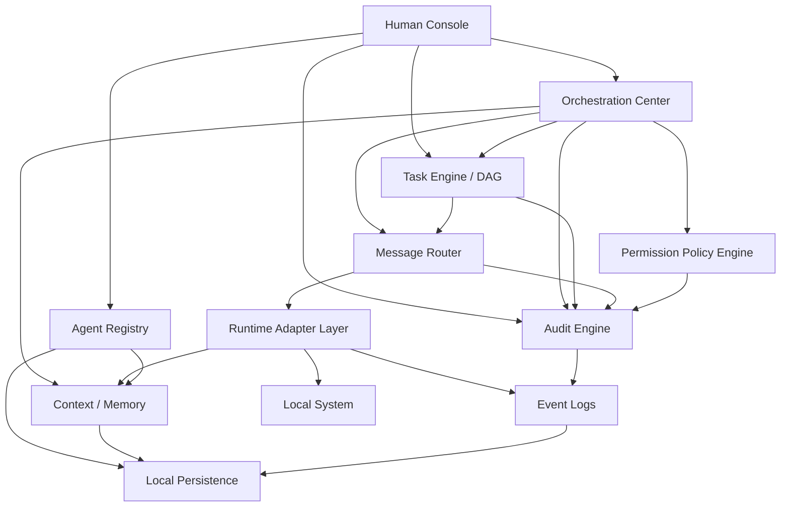

# System Architecture Components

This document defines the major system components for Local Codex Office. These components are product-level architecture modules, not necessarily one-to-one files. Implementation can start thin, but the boundaries should remain stable as the product grows.

## Target System Diagram

## Component Definitions

| Component | Purpose | Owns | Does Not Own |
| --- | --- | --- | --- |
| Human Console | The user-facing manager control surface. | Office UI, agent detail, chat, task board, meeting room, settings, cost views. | Runtime execution, database writes, permission policy decisions. |
| Agent Registry | The source of truth for known agents and their capabilities. | Agent identity, role, profile snapshot, skills, status, runtime kind, active session link, capability matrix metadata. | Starting processes directly, routing messages directly. |
| Orchestration Center | The application brain that coordinates multi-step product workflows. | Create-agent flow, run workflows, meeting workflows, task-to-agent assignment, escalation coordination. | Provider-specific runtime parsing, React rendering, raw DB queries. |
| Task Engine / DAG | The execution model for tasks, dependencies, review loops, and stop conditions. | Task states, dependencies, DAG nodes/edges, retry/review rules, workflow progress. | Chat transport, runtime provider details. |
| Message Router | The routing layer for user-agent and agent-agent messages. | Direct messages, broadcast messages, addressed meeting messages, review feedback routing, conversation metadata. | Agent identity source of truth, long-term memory. |
| Context / Memory | The context builder for runtime prompts and agent continuity. | Profile snapshots, assigned skill context, workspace context, user preferences, memory records, task/meeting context. | Permission approval, process spawning. |
| Permission Policy Engine | The policy layer for actions that can affect local state. | Permission presets, command risk rules, allow/deny decisions, scoped allow rules. | UI rendering of approval dialogs, raw runtime event storage. |
| Audit Engine | The product-level explainability and audit layer. | Domain event creation, audit trail, timeline records, transition reasons, permission decision records. | Low-level provider logs as the only source of truth. |
| Event Logs | Durable raw and normalized event storage. | Runtime events, domain events, timeline events, replay inputs. | Product policy decisions. |
| Runtime Adapter Layer | Provider integration layer. | Mock runtime, Codex CLI spawned runtime, attach mode, MCP bridge, future providers. | Product workflows, task rules, meeting orchestration. |
| Local Persistence | The local durable data boundary. | SQLite-compatible schema, migrations, repositories, local database file. | Renderer state, runtime process control. |

## Why These Components Are Needed

The product is not just a chat UI. It is an agent office where the human manager can create agents, assign work, coordinate reviews, monitor cost, and audit local execution. That requires explicit boundaries:

- Agent identity and capabilities must be separated from runtime provider sessions.
- Orchestration must be separated from UI components.
- Message routing must be separated from chat rendering.
- Task execution must be capable of graph and review-loop behavior.
- Context and memory must be reusable across chat, tasks, meetings, and runtime prompts.
- Permission policy must sit on the runtime path without making runtime adapters own policy.
- Audit must preserve product reasoning, not only raw stdout/stderr logs.

## Component Interaction Rules

- Human Console calls preload APIs through renderer stores.
- IPC handlers validate requests and call application services.
- Orchestration Center coordinates Agent Registry, Task Engine, Message Router, Context / Memory, Permission Policy, Audit Engine, and Runtime Adapter Layer.
- Runtime adapters emit runtime events and never mutate task board, meeting, cost dashboard, or registry state directly.
- Message Router routes messages to sessions or workflow participants but does not decide business rules.
- Task Engine can request messages through Message Router but does not know provider-specific runtime details.
- Context / Memory builds prompt context from approved product data, not from renderer-provided trusted snapshots.
- Permission Policy Engine must be called before app-controlled local commands execute.
- Audit Engine converts product decisions into domain events.
- Event Logs store facts; Audit Engine explains product decisions.

## MVP To V1 Implementation Shape

The first implementation of each component can be small:

| Component | MVP / V1 Thin Version |
| --- | --- |
| Human Console | Existing app shell, office canvas, detail drawer, chat, logs, skill badges. |
| Agent Registry | Repository-backed agent list plus capability metadata from profiles and skills. |
| Orchestration Center | Application services for create agent, send message, assign task, start meeting. |
| Task Engine / DAG | Task state machine first; DAG edges and dependency rules next. |
| Message Router | Session message routing first; meeting broadcast and addressed messages next. |
| Context / Memory | Profile snapshot + skill context + workspace context first; durable memory later. |
| Permission Policy Engine | Default-allow hook first; full approval policy in Task 17. |
| Audit Engine | Domain event writer first; richer audit views later. |
| Event Logs | Current `events` table plus runtime event persistence. |
| Runtime Adapter Layer | Mock runtime and Codex CLI spawned runtime. |
| Local Persistence | `sql.js` SQLite-compatible repositories. |

## Naming Notes

- `Agent Registry` is not the same as `Runtime Registry`.
- `Agent Registry` answers: which agents exist, what can they do, what state are they in?
- `Runtime Registry` answers: which runtime adapter owns this session?
- `Orchestration Center` is broader than `Meeting Room`.
- `Task Engine / DAG` is broader than `Task Board`.
- `Message Router` is broader than `Agent Chat`.
- `Audit Engine` is broader than `Event Logs`.
